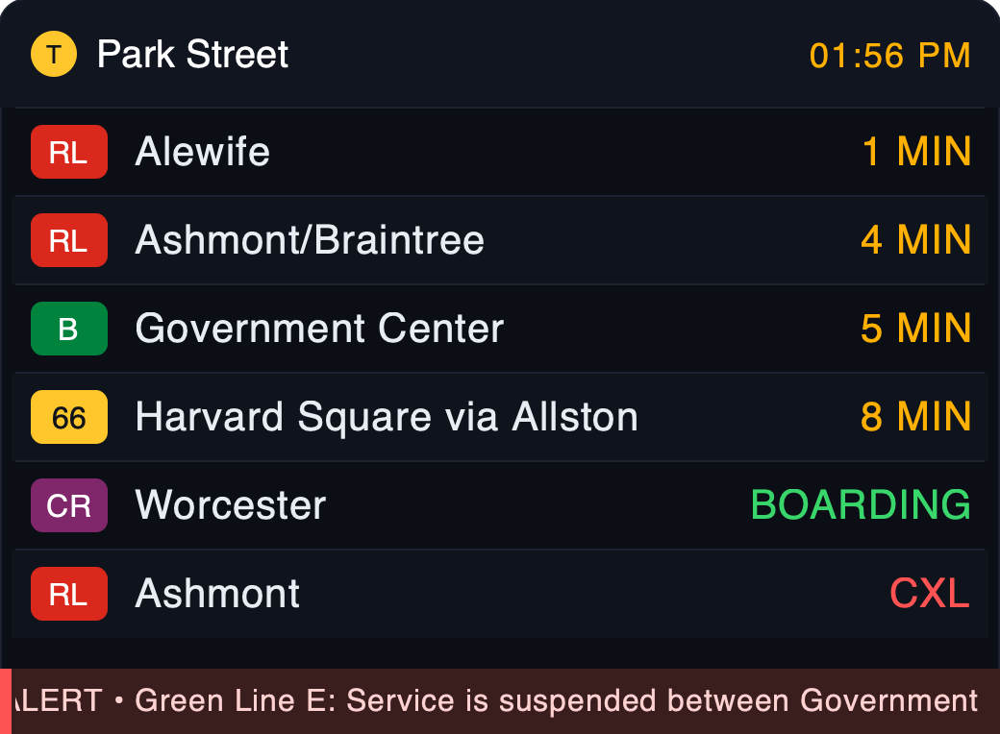

# MBTA for Home Assistant

A custom integration that surfaces **live MBTA arrival/departure predictions** and
**service alerts/delays** for a list of subway, bus, light‑rail, commuter‑rail, or
ferry stops, using the official [MBTA V3 API](https://www.mbta.com/developers/v3-api).

For each stop you configure you get:

- **A "Next departure" sensor** — state is the number of **minutes until the next
  departure**. Attributes include the next route, headsign/destination, direction,
  scheduled time, status, and a `departures` list of the next several trips.
- **A "Service alert" binary sensor** (`problem` device class) — **on** whenever
  there is an active alert affecting the stop (delays, suspensions, shuttles,
  detours, etc.). Attributes include `has_delay`, the list of `effects`, alert
  `headers`, and full alert details.

Each stop becomes its own **device** so the two entities are grouped together.

It also ships with a **custom Lovelace card** that renders a stop as an SVG
station arrival board, with a scrolling alert banner:



## Installation

### HACS (recommended)

1. In HACS → **Integrations** → ⋮ → **Custom repositories**, add this repository
   (`https://github.com/bbloomberg/mbta-hass`) with category **Integration**.
2. Search for **MBTA**, install it, and restart Home Assistant.

### Manual

Copy `custom_components/mbta` into your Home Assistant `config/custom_components/`
directory and restart Home Assistant.

## Configuration

Everything is done from the UI — no YAML.

1. Go to **Settings → Devices & Services → Add Integration → MBTA**.
2. **API key (optional but recommended):** paste an MBTA V3 API key. Without one you
   share a low, unauthenticated rate limit (~20 requests/minute across everyone on
   your IP); with a free key you get ~1,000/minute. Get one at
   <https://api-v3.mbta.com/register>.
3. Choose a **transit mode** → a **route** → then **select the stops** you care
   about. You can repeat this to add stops from multiple routes, then click
   **Finish**.

### Options

After setup, click **Configure** on the integration to adjust:

- **Update interval** — how often predictions/alerts are refreshed (default 60s,
  minimum 20s).
- **Upcoming departures to show** — length of the `departures` attribute list
  (default 5).

### Changing which stops you track

Click **Reconfigure** on the integration (the ⋮ menu on the integration entry) to:

- **Remove tracked stops** (uncheck the ones you no longer want),
- **Add stops from another route**, or
- **Change the API key**

…then click **Save**. The integration reloads with the new set of stops.

## The arrival-board card

The integration bundles a custom card (`custom:mbta-arrival-board-card`) and
auto-registers it as a frontend resource — **no manual resource setup is
needed**. After installing the integration and restarting, it appears in the
dashboard card picker as **"MBTA Arrival Board"**.

> If you don't see it immediately, do a hard refresh (Ctrl/Cmd-Shift-R) to clear
> the cached dashboard, since the card JS is freshly registered.

Minimal config:

```yaml
type: custom:mbta-arrival-board-card
entity: sensor.park_street_next_departure
```

All options:

| Option         | Default                            | Description                                                        |
| -------------- | ---------------------------------- | ------------------------------------------------------------------ |
| `entity`       | _(required)_                       | The stop's `*_next_departure` sensor.                              |
| `alert_entity` | derived from `entity`              | The stop's `*_service_alert` binary sensor (for the alert banner). |
| `title`        | stop name                          | Board heading.                                                     |
| `rows`         | `6`                                | Max departures to show. Increase the **Upcoming departures** option if you want more than 5. |
| `show_alerts`  | `true`                             | Show the scrolling alert banner when an alert is active.           |
| `show_clock`   | `true`                             | Show the current time in the header.                               |

Route badges are colored by MBTA line (Red/Orange/Blue/Green branches, purple
Commuter Rail, teal ferry, yellow bus); countdowns show `ARR`/live status in
green and `CXL` for cancellations.

## Example automation — alert me when my stop is delayed

```yaml
automation:
  - alias: "Notify on MBTA delay at Park Street"
    trigger:
      - platform: state
        entity_id: binary_sensor.park_street_service_alert
        to: "on"
    condition:
      - condition: state
        entity_id: binary_sensor.park_street_service_alert
        attribute: has_delay
        state: true
    action:
      - service: notify.mobile_app
        data:
          title: "MBTA delay"
          message: >
            {{ state_attr('binary_sensor.park_street_service_alert', 'alert_text') }}
```

## Development

Run the test suite (uses
[`pytest-homeassistant-custom-component`](https://github.com/MatthewFlamm/pytest-homeassistant-custom-component)):

```bash
pip install -r requirements_test.txt
pytest
```

CI runs on every push/PR via GitHub Actions:

- **Tests** — `pytest` on Python 3.12 and 3.13.
- **Validate** — Home Assistant `hassfest` (manifest validation) and HACS
  repository validation.

## Notes & limitations

- Predictions come straight from MBTA and inherit MBTA's own data quality; some
  trips are scheduled-only with no live prediction.
- Selecting a parent station (e.g. *Park Street*) automatically includes all of its
  platforms and every route that serves it (Red Line + Green Line branches, etc.).
- This project is not affiliated with or endorsed by the MBTA. Data is provided by
  the Massachusetts Bay Transportation Authority.

## License

MIT — see [LICENSE](LICENSE).
